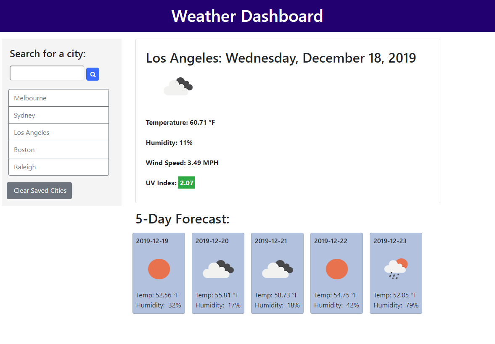

# Weather Dashboard

This project provides a dashboard to see current weather conditions and a 5-day forecast for a city entered by the user.   The application saves
the cities previously requested by the user in local storage, and when 
the page is reloaded it begins at the last city entered by the user.  

## User story 

As a traveler, I want to see the weather forecast for a city I plan to visit, so that I can plan my activities there accordingly.   

## Details 

The project uses AJAX and the [OpenWeather API](https://openweathermap.org/api) to retrieve weather data and appropriate icons for the cities the user enters. 

The page initially loads with data from Raleigh.  If the user enters a city, it's added to the list of buttons and saved in localStorage.  It also keeps the index of the last viewed city in local storage and starts with that city the 
next time the page is loaded.   

If the user clicks on a city in the saved city list, it displays the weather for that city.  

If the list gets very long and the user wants to clear out the list of
past cities, there is a "Clear Saved Cities" button.  

The application displays the following data:  

Current weather: 
  * City
  * Date (format changes depending on screen size)
  * Icon for current weather conditions 
  * Temperature
  * Humidity
  * Wind speed 
  * UV index (shown with green, yellow/orange, or red background depending on the value, determination of status from [US EPA](https://www.epa.gov/sunsafety/uv-index-scale-0) )

5-day forecast: 
  * date in mm/dd/yy format 
  * The temperature expected at 3 pm that day
  * Icon for weather conditions at that time 
  * Humidity 

